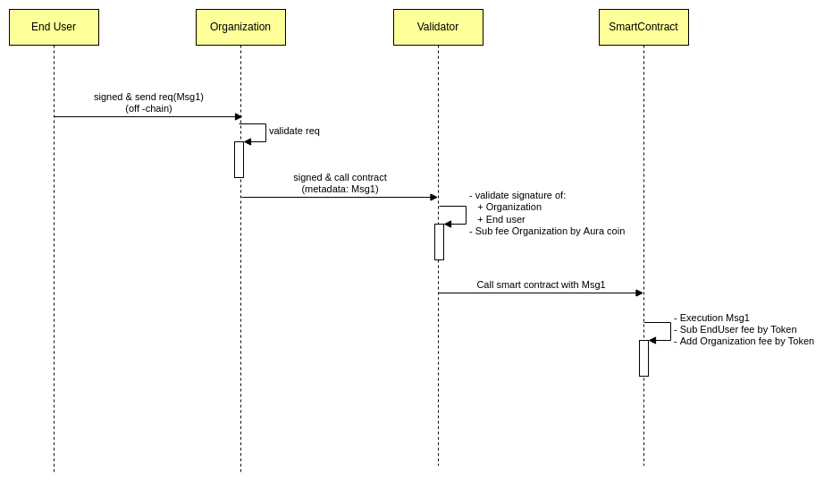

| AIP | Title     | Status | Type            | Author                        | Created (yyyy-mm-dd) | Updated (yyyy-mm-dd) |
|-----|-----------|--------|-----------------|-------------------------------|----------------------|----------------------|
| 1   | Fee token | Draft  | Standards Track | PhanHoc (phanhocit@gmail.com) | 2022-01-24           |                      |

## Abstract
The AIP introduces for the enterprise a solution to build an ecosystem on the aura network. All fees that customers use service will be paid by Aura coin.

## Motivation
We have already built a lot of products for the enterprise on the blockchain. That’s why we deeply understand their needs. It is made  the very simple user's operations.
Under the current blockchain platforms, fees for transactions that interact with smart contracts are paid by the platform's coins. Hence, end-users need to hold not only the platform's coins but also the tokens issued by the enterprise. It is an inconvenience for users who are not familiar with crypto.
This AIP support for the enterprise to issue their tokens and allows end-users to use the services without paying fees by the platform's coins. The network fee will be charged by the token

## Specification
Here is a flow that Aura network support end-user call smart contract pay fee by the token.

- End-User: customer of the enterprise and hold the token that enterprise issued
- Organization: The enterprise that issued tokens and build an ecosystem on the Aura network
- Validator: One of many nodes on the Aura network
- SmartContract: Business of the enterprise that defines on aura network

When end-users call smart contracts (using service of the enterprise) they need to hold only the issued token.
There are four steps of this cycle.
- Step 1: End-User will sign the message (Msg1) with the private key of themselves. Then, they send a signed message to Organization
- Step 2: Organization receives a signed message off-chain from End-User and pays gas (aura coin) to turn it into a valid transaction.
  At the step, Organization will create a transaction call to on-chain with metadata is the message that receives from End-User
- Step 3: Validator is the full node of Aura network, it will be validated:
    + Signature of Organization that sends the transaction to on-chain
    + Signature of End-User with the message that was signed (Msg1)  
      After that, the network will sub transaction fee from the account fee of the Organization and call execute the smart contract with the message that was signed by End-User
- Step 4: Smart contract execution message from End-User, change any state. It will be sub fee (token of organization) of End-User and an additional fee for Organization 
